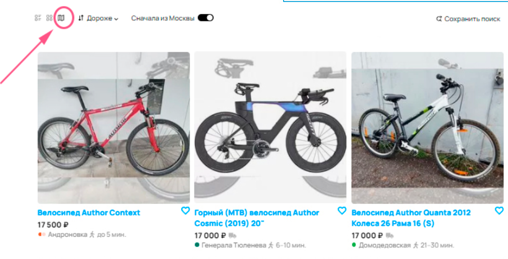
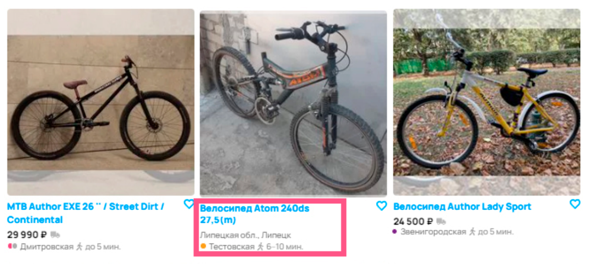
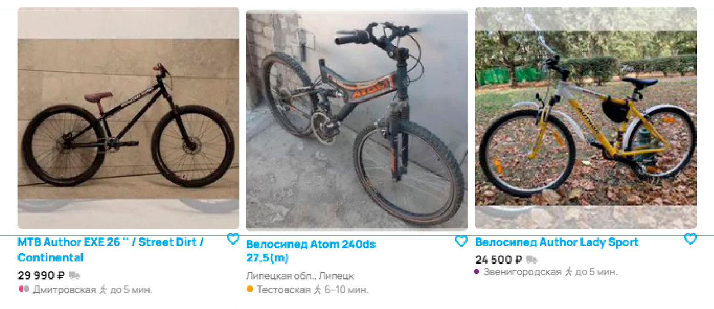
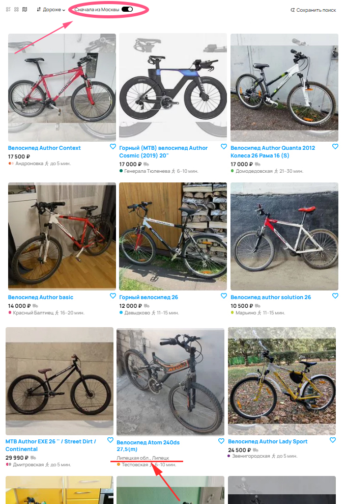
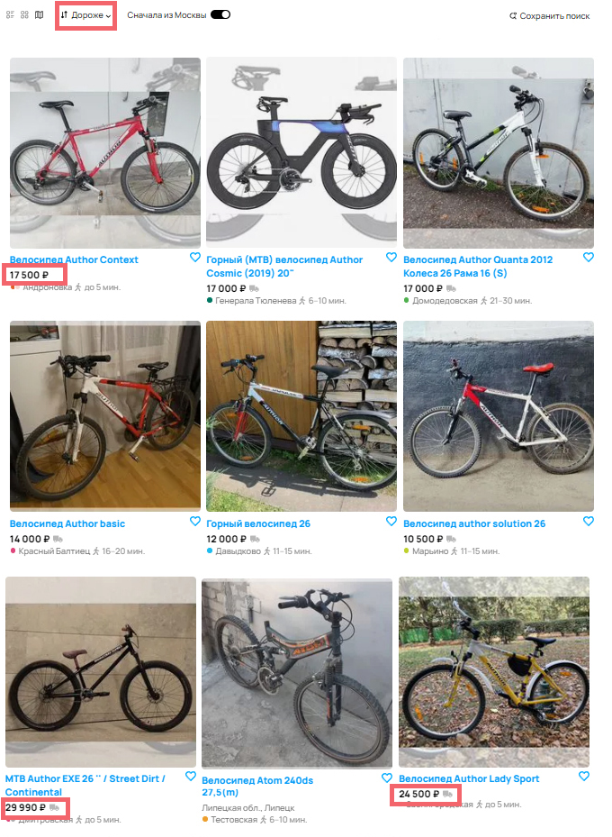
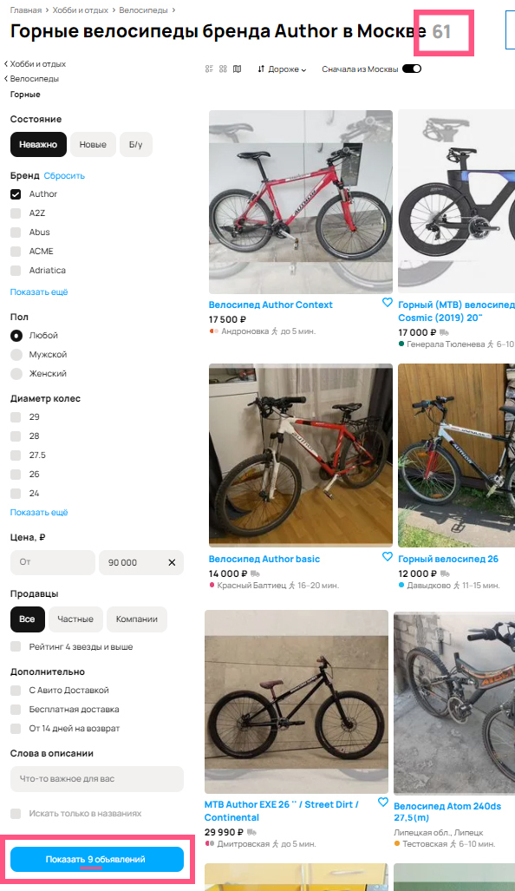
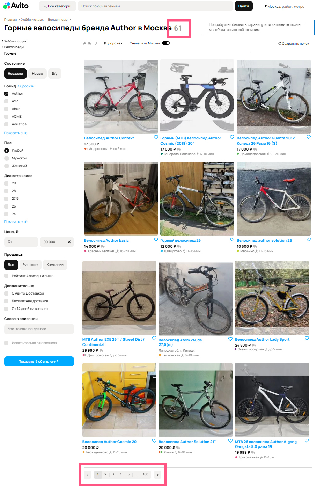
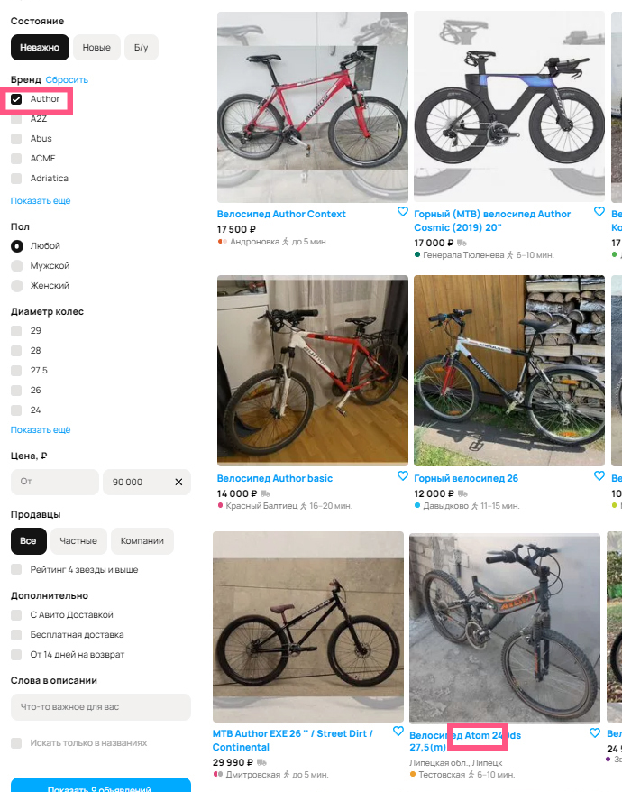

# Task 1

## Bug #1

**Описание:**
Текст на кнопке «Все категории» содержит грамматическую ошибку

**Текущий результат:**

  

**Ожидаемый результат:**
На кнопке отображается текст: «Все категории»

**Приоритет:**
low (при условии, что кнопка остается кликабельной и выполняет свою задачу)

## Bug #2

**Описание:**
Стиль кнопки «Все категории» отличается от принятого в дизайне системы

**Текущий результат:**

  

**Ожидаемый результат:**
Цвет кнопки  #0099F7; цвет текста на кнопке #FFFFFF

**Приоритет:**
low (при условии, что кнопка остается кликабельной и выполняет свою задачу)

## Bug #3

**Описание:**
Цвет кнопки «Найти» отличается от принятого в дизайне системы

**Текущий результат:**

  

**Ожидаемый результат:**
Цвет кнопки  #0099F7

**Приоритет:**
low (при условии, что кнопка остается кликабельной и выполняет свою задачу)

## Bug #4

**Описание:**
Текст локации поиска объявлений не полный: не отображается радиус поиска

**Текущий результат:**

  

**Ожидаемый результат:**
В локации после «метро» через запятую указан «радиус»

**Приоритет:**
medium

## Bug #5

**Описание:**
Хлебные крошки (breadcrumbs) не отображают реальный путь 
от начальной категории до той, на которой сейчас находится пользователь:  
после категории «Велосипеды»  не отображается категория «Горные»

**Текущий результат:**

  

**Ожидаемый результат:**
Хлебные крошки отображают полный путь до последней выбранной категории включительно

**Приоритет:**
low

## Bug #6

**Описание:**
При выборе отображения объявлений в формате «Карта»,  
интерактивная карта с размещенными на ней объявлениями не отображается 

**Текущий результат:**

  

**Ожидаемый результат:**
Отображается интерактивная карта с метками, указывающими местоположение объявлений. 
Пользователь имеет возможность просматривать объявления, взаимодействуя с картой 
(перемещаясь по ней, масштабируя, кликая по меткам)

**Приоритет:**
high

## Bug #7

**Описание:**
В карточке объявления «Велосипед Atom 240ds 27,5 (m)» не отображается цена

**Текущий результат:**

  

**Ожидаемый результат:**
Под названием товара в карточке отображается цена

**Приоритет:**
high

## Bug #8

**Описание:**
Карточка объявления «Велосипед Atom 240ds 27,5 (m)» не выровнена относительно соседних элементов

**Текущий результат:**

  

**Ожидаемый результат:**
Карточка выровнена относительно соседних элементов

**Приоритет:**
low

## Bug #9

**Описание:**
Некорректная работа фильтра «Сначала из Москвы»:  
в начале результатов поиска между объявлениями с локацией «Москва» 
отображается объявление с городом «Липецк»

**Текущий результат:**

  

**Ожидаемый результат:**
В начале результатов поиска расположены объявления только с локацией «Москва»

**Приоритет:**
high

## Bug #10

**Описание:**
Фильтр сортировки по стоимости «Дороже» работает некорректно: 
найденные объявления не отсортированы по цене от дорогих к дешевым

**Текущий результат:**

  

**Ожидаемый результат:**
Объявления отсортированы по цене от дорогих к дешевым

**Приоритет:**
high

## Bug #11

**Описание:**
Текст кнопки «Показать N объявлений» содержит некорректную информацию: 
не совпадает количество объявлений (N) на кнопке «Показать N объявлений» 
и в заголовке страницы «Городские велосипеды бренда Author в Москве N» 
*Мы полагаем, что на кнопку «Показать N объявлений» уже нажали и все фильтры применились

**Текущий результат:**

  

**Ожидаемый результат:**
Количество объявлений (N) на кнопке «Показать N объявлений» 
равно количеству объявлений в заголовке страницы «Городские велосипеды бренда Author в Москве N»

**Приоритет:**
medium

## Bug #12

**Описание:**
Завышено количество страниц в пагинации результатов поиска: 
в пагинации выделено 100 страниц для 61 шт. объявлений (которые отображаются по 12 шт. на странице)

**Текущий результат:**

  

**Ожидаемый результат:**
В пагинации отображается 6 страниц 
(общее количество объявлений, деленное на количество объявлений на одной странице)

**Приоритет:**
medium

## Bug #13

**Описание:**
Поиск по фильтру «Бренд» работает некорректно:  
при выбранном фильтре по бренду со значением «Author», присутствует объявление с велосипедом бренда «Atom»
*Не считается багом если продавец ошибочно указал бренд «Author», когда выкладывал объявление

**Текущий результат:**

  

**Ожидаемый результат:**
В результатах поиска отображаются только велосипеды выбранного бренда «Author»

**Приоритет:**
high