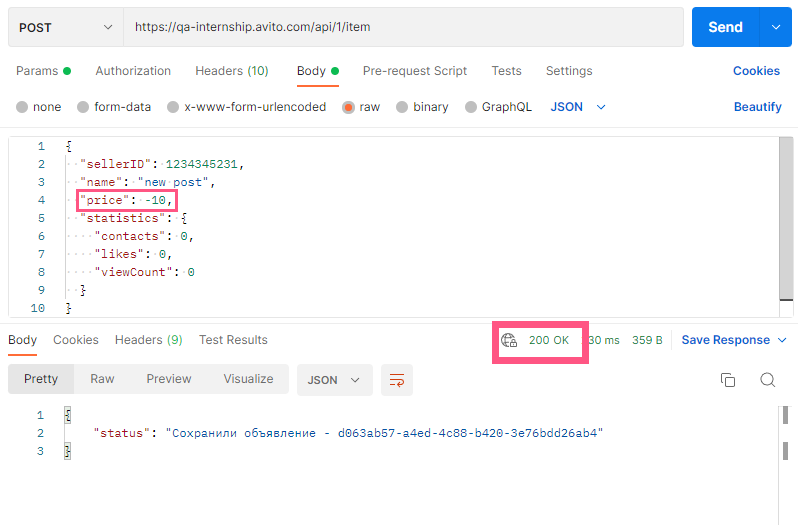

# Bug report

#### Bug ID 	1
**Testcase ID:**
3
**Описание:**
POST-запрос на создание объявления допускает пустое тело
**Шаги воспроизведения:**	
Отправить POST-запрос с пустым телом {} на https://qa-internship.avito.com/api/1/item 
**Ожидаемый результат:**
Status code – 400 Bad Request
**Фактический результат:**
Status code – 200 OK
 
**Приоритет:**
high

 #### Bug ID 	2
**Testcase ID:**
4
**Описание:**
POST-запрос на создание объявления допускает отрицательные числовые значения
**Шаги воспроизведения:**	
Отправить POST-запрос на https://qa-internship.avito.com/api/1/item 
со следующими данными:
```
{
  "sellerID": 1234345231,
  "name": "new post",
  "price": -10,
  "statistics": {
    "contacts": 0,
    "likes": 0,
    "viewCount": 0
  }
}
```
**Ожидаемый результат:**
Status code – 400 Bad Request
**Фактический результат:**
Status code – 200 OK
 
**Приоритет:**
high

 #### Bug ID 	3
**Testcase ID:**
5
**Описание:**
POST-запрос на создание объявления допускает отсутвие обязательных полей (sellerID, name, price)
**Шаги воспроизведения:**	
Отправить POST-запрос на https://qa-internship.avito.com/api/1/item
со следующими данными:
```
{
  "name": "new post",
  "price": 1
}
```
**Ожидаемый результат:**
Status code – 400 Bad Request
**Фактический результат:**
Status code – 200 OK
 
**Приоритет:**
high

 #### Bug ID 	4
**Testcase ID:**
12
**Описание:**
GET-запрос на получение объявления по несуществующему id продавца возвращает успешный статус код
**Шаги воспроизведения:**	
Отправить GET-запрос на https://qa-internship.avito.com/api/1/:sellerID/item , 
где :sellerID = 99111
**Ожидаемый результат:**
Status code – 400 Bad Request
**Фактический результат:**
Status code – 200 OK
 
**Приоритет:**
medium